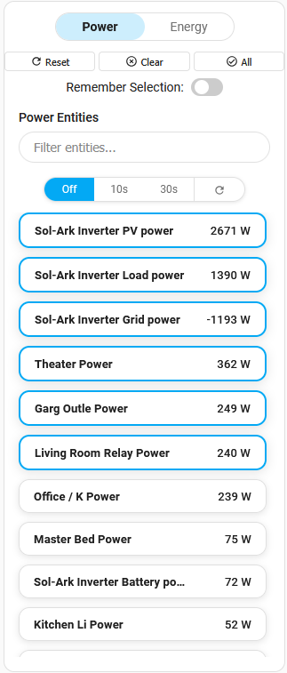
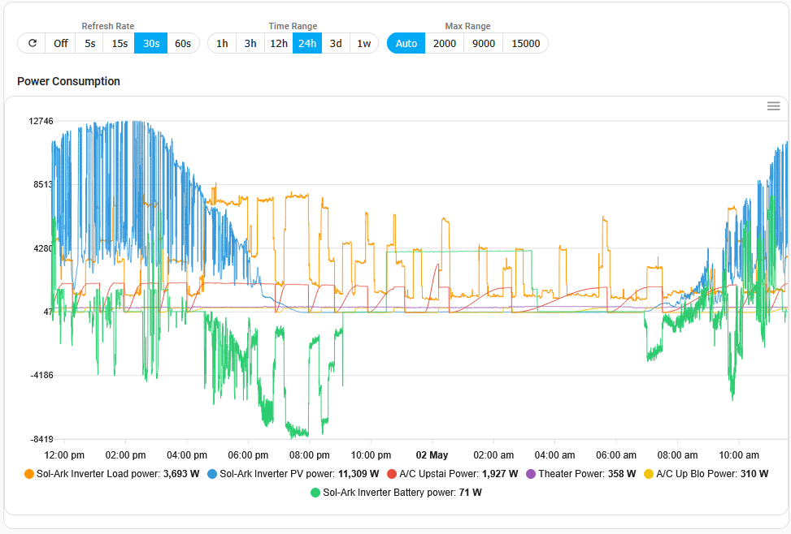

# Energy Dashboard

A Home Assistant custom dashboard for visualizing and managing power and energy entities. Includes two main cards:
- **Entity Card**: Select, filter, and control which entities are shown.
- **Chart Card**: Visualize power and energy usage with configurable charts.

## Card Previews

**Entity Card Example:**

**Chart Card Example:**

## Requirements

- **apexcharts-card is required** for the chart card to function. Install it via HACS before using this dashboard.

## Installation in HACS

1. Go to HACS in Home Assistant.
2. Click the three dots (⋮) in the top right and select **Custom repositories**.
3. Add this repository's URL as a custom repository (select type: "Dashboard").
4. Search for **Energy Dashboard** and install it as a dashboard.
5. Install **apexcharts-card** (search for "ApexCharts Card" in HACS and install).
6. Refresh your browser and add the cards to your dashboard from the UI.

## Card Layout & Home Assistant Recommendations

These cards are designed to be managed by the Home Assistant Layout control. For best results:
- **Chart Card**: Set width to **24** (full-width in most layouts)
- **Entity Card**: Set width to **9** (sidebar style)

This ensures the chart is large and readable, while the entity card remains compact and easy to use.

## Configuration Options

### Entity Card
- `title`: Card title
- `show_header`: Show/hide header
- `show_state`: Show/hide entity state
- `show_toggle`: Show/hide toggle
- `auto_select_count`: Number of entities to auto-select
- `max_height`: Max height for scrollable entity list
- `persist_selection`: Remember selection between reloads
- `entity_removal_filter`: Filter to remove entities by name or ID. **Format:** `string1,string2|mode`  
  - Example: `kitchen,bedroom|contains` removes entities whose names contain "kitchen" or "bedroom".
  - **Modes:**
    - `contains` (default): Remove if name contains any term
    - `exact`: Remove if name exactly matches a term
    - `start`: Remove if name starts with a term
    - `entity_id`: Remove if entity_id contains a term
- `refresh_rate`: Refresh interval for entity updates (`off`, `10s`, `30s`)

### Chart Card
- `title`: Card title
- `show_header`: Show/hide header
- `show_energy_section`: Show/hide energy chart
- `chart_height`: Chart height in px
- `show_points`: Show/hide data points
- `smooth_curve`: Use smooth lines
- `stroke_width`: Line thickness
- `update_interval`: Chart refresh interval (seconds)
- `hours_to_show`: Time range for chart
- `chart_options`: Advanced chart options (y_axis min/max/title/unit/decimals)
- `use_custom_colors`: Use custom colors for chart
- `show_legend`: Show/hide chart legend
- `y_axis_max_presets`: Preset Y-axis max values

## Usage

1. Add the cards to your Home Assistant dashboard (via YAML or UI). The cards are designed to be added from the UI and configured within the card configuration panel.
2. Configure options as needed (see above).
3. Use the entity card to select/filter entities. Use the chart card to visualize data.

## Technical Details

- Built with vanilla JavaScript and Web Components (no external UI library dependencies)
- Uses browser localStorage for persistence:
  - Power entity selections: `energy-dashboard-power-toggle-states`
  - Energy entity selections: `energy-dashboard-energy-toggle-states`

## Contributing

Contributions are welcome! Please submit a Pull Request.

### Development

1. Clone the repository
2. Install dependencies: `npm install`
3. Make your changes
4. Build the project: `npm run build`
5. Test in Home Assistant

## Support

- Star the repository on GitHub
- Report issues or feature requests via GitHub
- Share your experiences or feature ideas in the discussions
